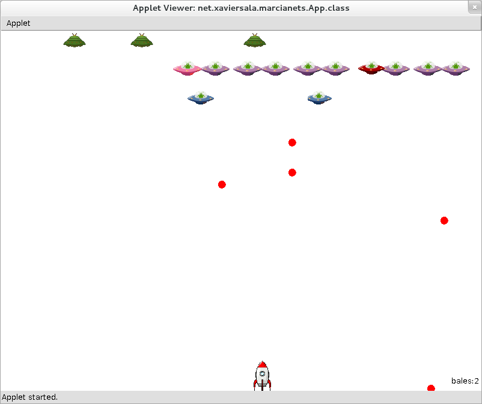
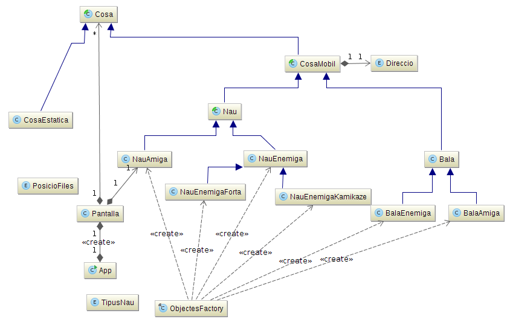

Marcianets
============
Es tracta d'un programa que fa el que fan els tradicionals jocs de matamarcians fent servir la llibreria ACM que permet fer-ho de forma senzilla.

Joc
------------
Es té una nau que es pot moure lateralment i que ha de liquidar totes les naus extraterrestres superiors.

La nau es mou amb les tecles esquerra ( <-- ), dreta ( --> ) i dispara (fletxa amunt). El carregador només té 6 bales però es pot recarregar una bala amb la tecla (R)

Notes
--------
El codi no és perfecte perquè està pensat per ensenyar als alumnes els avantatges que s'obtenen fent servir herència i polimorfisme. L'estructura d'objectes que s'està fent servir és la següent:

L'objecte principal és pantalla el qual se n'encarrega de carregar tot el que cal per començar i després també gestiona l'aparició, desaparició dels diferents objectes del joc (naus, bales, etc..)

En alguns punts és molt clar que segurament caldria canviar alguna classe per una interfície (però encara no n'hem parlat a classe)

Todo
----------
Hi ha moltes millores possibles que qui vulgui pot encarar...

* Només hi ha una sola pantalla
* Es poden afegir noves naus enemigues que facin coses diferents
* Es poden diferenciar les bales de les naus
* Es poden afegir objectes estàtics a pantalla com proteccions, etc.. (actualment hi ha la classe però no es fa servir per res)
* ...
